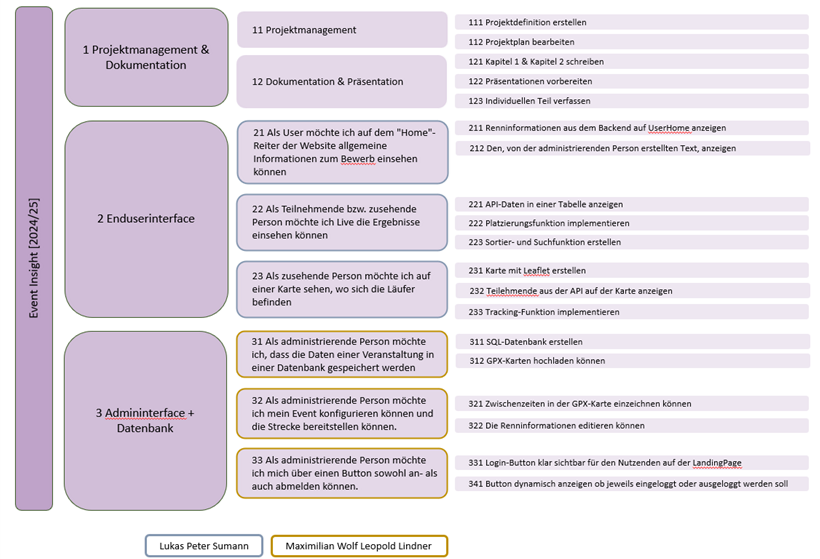

# Event Insight

## Entwicklerteam
maximilian.lindner@edu.htl-klu.at (Entwicklung des Administratorinterfaces)  
lukas.sumann@edu.htl-klu.at (Entwicklung des Enduserinterfaces)  

Dieses Projekt wurde mit [Create React App](https://github.com/facebook/create-react-app) initialisiert.

## Kurzbeschreibung
Event Insight ist eine Webanwendung zur Echtzeitverfolgung und Verwaltung von Sportveranstaltungen. Veranstaltende können über ein Administrationsinterface Renndaten einpflegen, Live-Ergebnisse verwalten und GPX-Daten zur Streckendefinition hochladen. Die RaceMap visualisiert die Positionen der Teilnehmenden basierend auf den von RaceResult AG gelieferten Zwischenzeiten und berechneten Geschwindigkeiten. Ziel ist es, die Veranstaltung interaktiv zu gestalten und Zusehenden eine präzise Live-Ansicht des Rennverlaufs zu bieten.

Die verwendete Schnittstelle ist die SimpleAPI von RaceResult AG, über die Daten zyklisch eingelesen werden.

## Funktionen

### Admin Interface (Maximilian Lindner)
- Verwaltung von Veranstaltungen
- Konfiguration des Userinterfaces
- GPX-Upload für die Streckendefinition
- Veröffentlichung von Zwischenständen und Ergebnissen
- Integration und Verwaltung der RaceMap

### Enduser Interface (Lukas Sumann)
- Live-Visualisierung von Teilnehmenden auf der RaceMap
- Tabellenansicht für Zeiten und Positionen
- Suchfunktion nach Teilnehmenden
- Echtzeit-Datenanzeige basierend auf RaceResult-Daten

## Scrum

## Verzeichnisstruktur
* [misc](misc) → Bilder, Datenblätter, Diagramme, Dokumente
* [software](software) → Frontend- und Backend-Code des Projekts

## Technologien
- React.js (Create React App)
- Leaflet (Kartenvisualisierung)
- Axios (API-Zugriffe)
- Node.js / Express (Backend)
- RaceResult SimpleAPI
